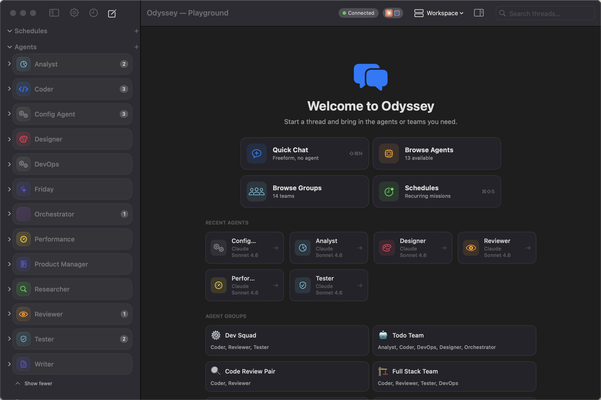
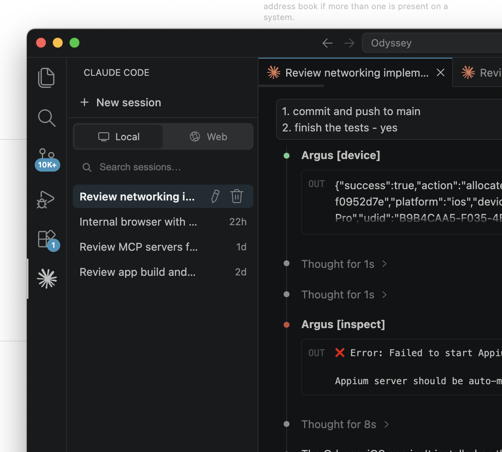
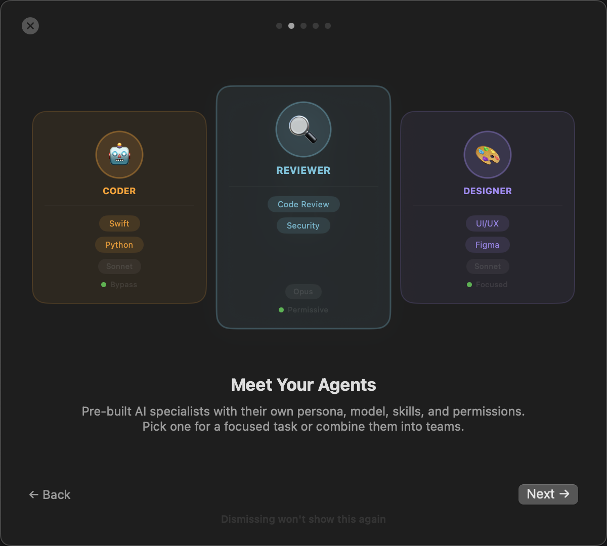
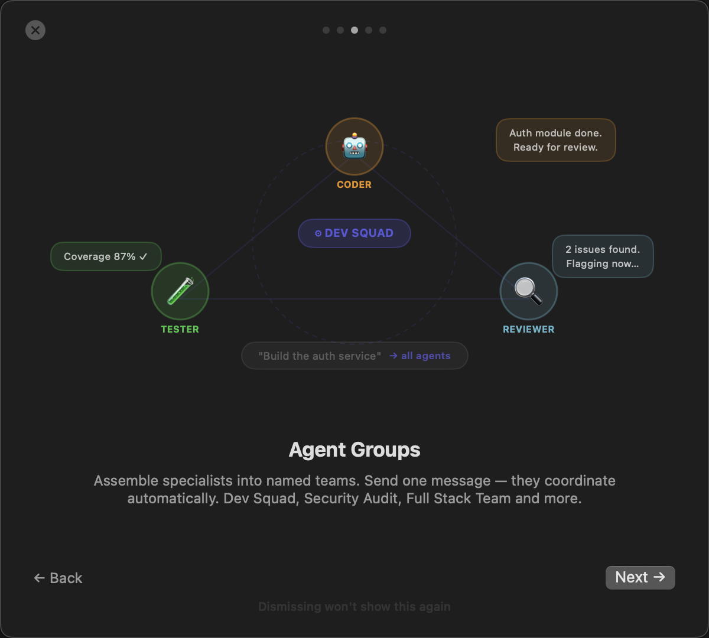
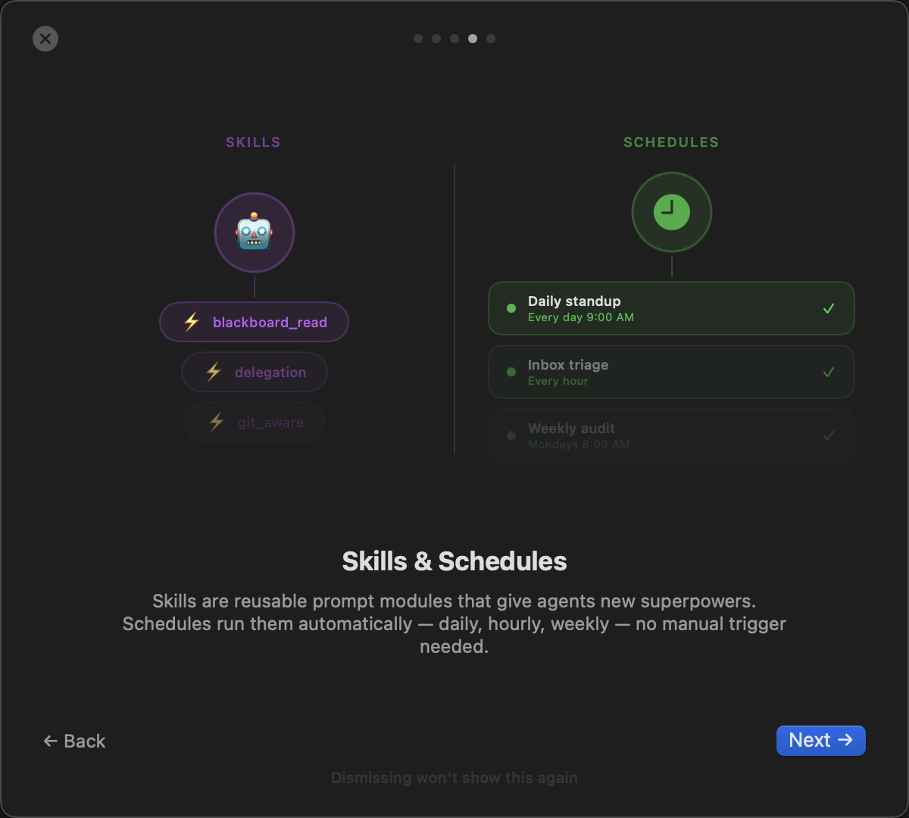
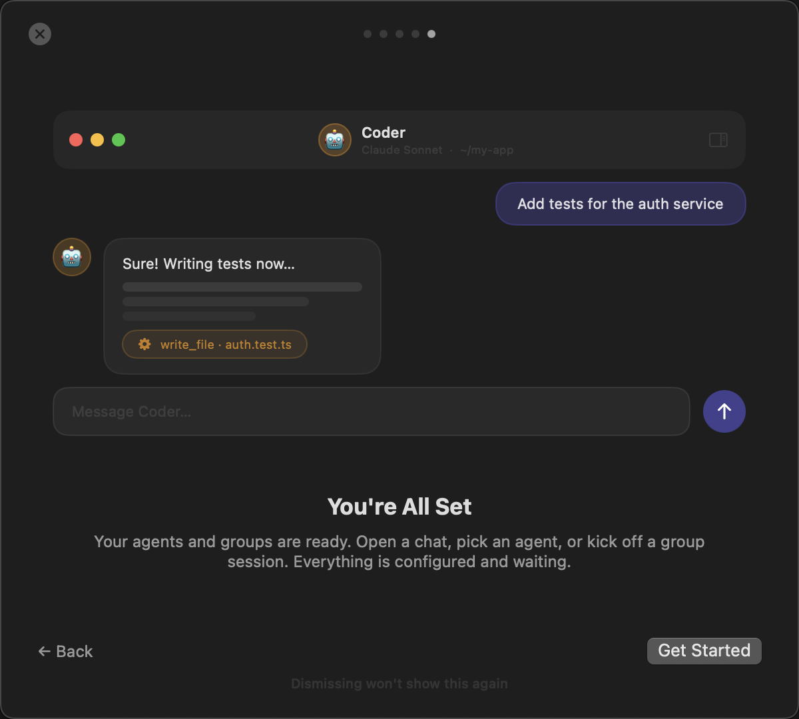

# Odyssey

**Odyssey** is a native macOS app for running, orchestrating, and collaborating with AI agents — powered by [Claude](https://anthropic.com) (Anthropic's Agent SDK).

It gives you a persistent, project-aware workspace where multiple AI agents can work together in real time: writing code, browsing files, managing tasks, sharing memory, and communicating with each other — all from a single native interface.

---

## Why Odyssey?

Most AI chat interfaces are stateless and single-threaded. Odyssey is built for a different model:

- **Agents are first-class citizens** — define agents with specific skills, tools, and permissions, not just system prompts
- **Projects give context** — agents know what codebase they're working in, what tasks are pending, and what their teammates know
- **Multi-agent by default** — run several specialized agents in the same conversation, or fan work out to a team
- **Your machine, your data** — everything runs locally; the only outbound traffic is to Claude

---

## Features

### Agent Workspace
- Create and configure agents with skills, MCP servers, and permission sets
- Run multiple agents in parallel sessions with independent contexts
- Resume sessions across restarts via Claude's session continuity
- Fork any conversation from any message with full lineage tracking
- **Parallel instances** — run multiple Odyssey windows with automatic lock-based naming

### Built-in Agent Library
- Ready-to-use executive team: **CEO, CTO, CMO, CFO, CPO** agents
- **Lean Startup group** — CEO-led cross-functional team ready out of the box
- **Ulysses** — your app companion for guidance, config management, and natural-language control ("list agents", "open a chat", "schedule a task")

### Project-First Shell
- Top-level **Projects** own threads, tasks, schedules, and workspace context
- Attach a GitHub repo to a project — agents clone and work in it automatically
- Inspector panel with live file tree and git status
- Export conversations as Markdown, HTML, or PDF

### GitHub Issues Integration
- **GitHub Inbox** sidebar section — see open issues assigned to your inbox repo in real time
- Triage with context-menu actions: assign to an agent, run now, close, or resume
- **Create Issue** from any conversation — route to the right agent or group automatically
- Agents can open and close issues via the `create_github_issue` tool
- One-click daemon install for the GitHub poller service

### Multi-Agent Collaboration
- Invite multiple agents into the same conversation thread
- Agent-to-agent messaging, delegation, and blocking chat
- Group fan-out: broadcast to a team of agents with budget limits and deduplication
- Unified **Agent Comms** timeline with filter tabs

### Task Board
- Project-scoped task board with full lifecycle: `backlog → ready → in progress → done`
- Priority levels, labels, and agent assignment
- Agents can create, update, and query tasks via built-in tools

### Schedules
- Schedule any agent or group to run on a cron-style interval
- **Project-aware working directory** — schedules default to their agent's project root
- **Foldable run history** — recent runs shown inline under each schedule in the sidebar
- Auto-fill working directory from the assigned agent or group

### Shared Memory (Blackboard)
- Persistent key-value store shared across all agents in a project
- Agents can read/write the blackboard via tools
- Scoped per project, persisted to disk

### P2P Networking
- **Nostr P2P DM routing** — connect to other Odyssey instances over the decentralized Nostr network with multi-peer support
- Discover instances on the same LAN via Bonjour
- Import agents and skills from peers
- Foundation for future cross-machine agent collaboration

### Local Models (MLX)
- Run open-source models locally via MLX on Apple Silicon
- **Gemma 4 family** — 4B, 26B MoE, and 31B variants
- Model library with inline Download, Delete, and status controls
- Right-click context menu on model rows

### Voice Mode
- **Hold mic to speak** — agents respond aloud via text-to-speech
- Natural back-and-forth voice conversations with any agent

### Odyssey-Control MCP
- Structured app-control tools available to any Claude session
- Let external Claude sessions open chats, list agents, and manage projects

### Rich Interaction
- Streaming responses with extended thinking, images, and file cards
- `ask_user` tool: agents can ask structured questions (forms, toggles, ratings, choices)
- `render_content`, `show_progress`, `suggest_actions` for rich in-chat UI
- Plan mode: Opus-powered interactive planning workflow
- Auto-expanding input with drag-and-drop file and image attachments

### Developer Tools
- Structured JSON logging with per-category filtering
- Debug log viewer in-app
- AppXray accessibility integration for UI automation

---

## Requirements

- macOS 14.0 (Sonoma) or later
- Apple Silicon or Intel Mac
- [Claude Code](https://claude.ai/code) subscription (Max plan recommended)

---

## Install

1. Download the latest **Odyssey-x.x.x.dmg** from [Releases](https://github.com/shayke-cohen/Odyssey-releases/releases)
2. Open the DMG and drag **Odyssey.app** to your Applications folder
3. Make sure [Claude Code](https://claude.ai/code) is installed and authenticated (`claude` in your PATH)
4. Launch Odyssey — it picks up your Claude Code session automatically

> Odyssey is signed with a Developer ID certificate and notarized by Apple — macOS Gatekeeper will clear it automatically.

### Auto-Update

Odyssey checks for updates automatically via [Sparkle](https://sparkle-project.org). You can also trigger a manual check from **Odyssey → Check for Updates…**

---

## Screenshots

### Main Interface

### Onboarding

<table>
<tr>
<td align="center"> <b>Welcome</b></td>
<td align="center"> <b>Meet Your Agents</b></td>
<td align="center"> <b>Agent Groups</b></td>
</tr>
<tr>
<td align="center"> <b>Skills &amp; Schedules</b></td>
<td align="center"> <b>You're All Set</b></td>
<td></td>
</tr>
</table>

---

## Feedback & Issues

This is the **public releases** repository. Source code lives in the private [Odyssey](https://github.com/shayco-cohen/Odyssey) repo.

For bug reports or feature requests, please open an issue in this repository.
